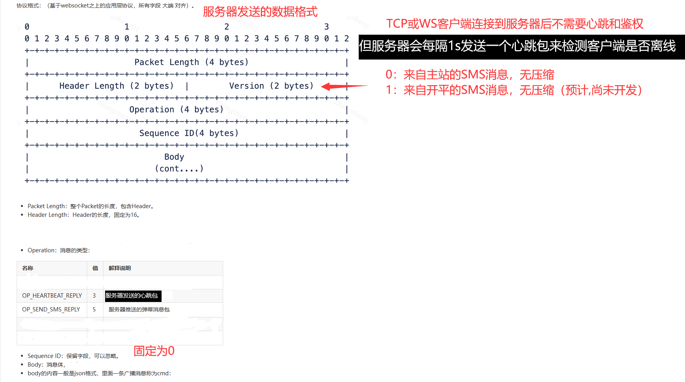

# BLiveTransponder

B站直播间弹幕消息转发器

本项目为Godot项目

程序启动时会在本地自动开启WS和TCP服务器并转发SMS消息

本项目服务器发送的数据包均为如下格式  (只对原本数据格式做了极小的调整,使接入者基本无需改动自己项目原有的逻辑)

免责声明：

本项目使用的接口为B站野生接口,官方随时可能对其改动,本项目不能保证其稳定性

本项目原则上只赞成用户在自己直播间使用(房管或运营亦可),请勿在他人未同意的情况下在其直播间使用

本项目在使用过程中所产生的所有用户信息(Cookie,用户B站信息)均只保存在用户本地,不存在任何泄露行为

本项目以及所使用到的依赖均以开源,可通过下方链接按钮直接访问,欢迎使用者监督

如使用者担心账号信息泄露或风控等问题,请务必使用游客登录或使用小号扫码登录